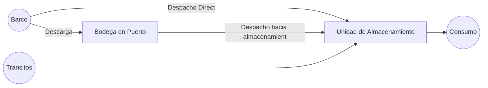
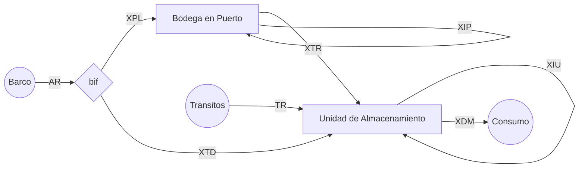
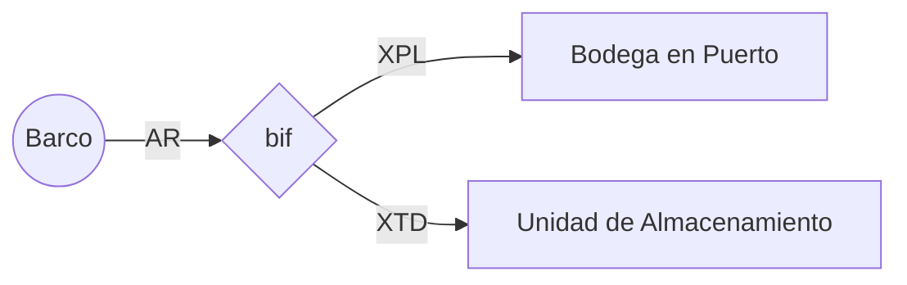
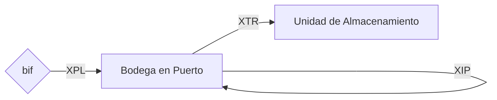
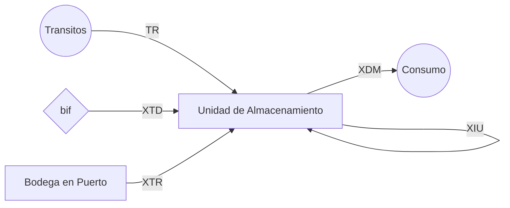
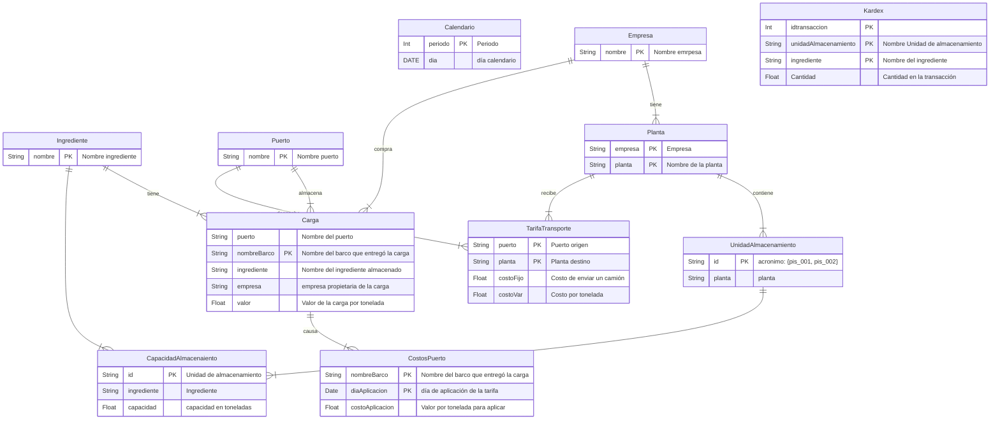

# Modelo matemático

## Abstract

El presente documento contiene el modelo matemático de programación lineal mixta que describe la situación de almacenamiento, transporte y demanda de macro ingredientes para la compañia Grupo BIOS.

## Contexto del problema

Grupo BIOS es un grupo de empresas dedicadas a la fabricación de productos agrícolas destinados a diferentes propósitos. Para efectos de dicha fabricación emplea varias materias primas que son procesadas en 13 plantas al interior de Colombia y que tienen origen en el extranjero.

Dado el origen de las materias primas, surgen una serie de operaciones logísticas para colocarlas en las plantas con sus correspondientes costos y restricciones asociadas.

El modelo matemático descrito a continuación ayudará como herramienta a un usuario experto en la operación de Grupo BIOS a configurar la mejor decision logística partiendo de la información disponible y suministrada, y que de acuerdo con los entendimientos durante las reuniones del equipo de trabajo, conduce hacia obtener el menor costo logistico durante un periodo dado. Dicha decision está asociada específicamente con determinar:

- La cantidad de materias primas a almacenar en puerto de acuerdo con la información de barcos pendientes por llegar y las cargas actualmente almacenadas a los puertos;
- la cantidad de materias primas a despachar y el momento para hacerlo entre los puertos y las 13 plantas y la unidad de despacho a donde llegarán estas cargas;
- Las unidades de almacenamiento desde donde deberán consumirse las materias primas de acuerdo con la demanda proyectada de consumo que el usuario experto suministre.

El modelo matemático no tendrá como objetivo responder a preguntas o cuestiones adicionales relacionandas con otras decisiones o aspectos, por ejemplo:

- la cantidad de materias primas a comprar;
- la cantidad de materias primas a consumir para fabricar el producto terminado;
- la forma como se mezclarán las materias primas en las plantas;
- los esquemas de negociación de tarifas de almacenamiento, transporte;
- ni ningún otro aspecto del negocio que no haya sido explícitamente discutido, aprobado y costeado por parte de WA Solutions, Esteban Restrepo y Luis Fernando Pinilla.

## Conceptualización de la solución

El modelo matemático que se ha identificado como el más adecuado para aproximar una solución que ayuda al usuario a configurar la solución descrita, corresponde a un modelo de optimización para flujo en redes con nodos y arcos, que incluye el tiempo como parámetro enriquecido y restricciones conmutables usando variables binarias. 

En general, cada nodo abstrae la cantidad de inventario de un ingrediente particular en un periodo y lugar específico de la cadena de suministro que se ha incluído en el modelo y los arcos representan traslado de dicho inventario entre los nodos, lo anterior teniendo en cuenta en todo momento los balances de masa.

Esquemáticamente, el flujo de material sin tener en cuenta el tiempo, puede representarse de la siguiente manera:

# Modelo matemático

Los modelos matemáticos son conjuntos de expresiones matemáticas relacionadas entre si que describen un sistema y permiten efectuar cálculos con el fin de encontrar una alternativa que optimiza la manera de alcanzar un objetivo mientras que se satisfacen una serie de restricciones que representan aspectos puntuales del sistema.

El sistema que se pretende modelar ha sido descrito por el personal de Grupo BIOS durante sesiones de trabajo con el equipo de WA Solutions, quien ha construido el modelo a partir de la interpretación resultante en cada sesión de trabajo.

Las expresions matemáticas son construidas usando variables, conjuntos y parámetros, que serán descritos a continuación.

## Variables, parámetros y conjuntos

### Sets:

El modelo tiene una granularidad diaria, los días en el horizonte de planeación definido constituye el conjunto de periodos.

$T$ : día $i = 1,2,...,30$

Las empresas involucradas en la operación son Contegral y Finca. La importancia de este conjunto radica en hay un costo relevante de "venta" de material entre una y otra cuando sea necesario.

$E$ : Empresas $e = Contegral, Finca$

Los ingredientes que serán almacenados en distintos puntos de la cadena de suministro relevante al modelo componen el conjunto de ingredientes.

$I$ : Ingredientes $i = Maiz, Harina, ...$

Los puertos a donde llega la carga y desde donde se puede despachar el producto o almacenarlo según sea conveniente, además son el punto de origen en la tabla de fletes para obtener el costo de transporte, constituyen el conjunto de puertos

$J$ : Puertos $j = Buenaventura, Santamarta, Cartagena, ...$

Las 13 plantas distribuidas al interior del país y que consumen los macro ingredientes del conjunto ya descrito, y que son el destino para el cálculo de los costos de transporte, además de totalizar la capacidad de almacenamiento y requerir inventarios de seguridad, constituyen el conjunto de plantas.

$K$ : Plantas $k = Medellín, Bogotá, ... \in E$ 

La agrupación entre un ingrediente y el nombre del barco permiten individualizar una carga, desde donde se pueden obtener atributos como la cantidad de producto pendiente por llegar a puerto o, almacenada en bodega en el mismo, constituyen una carga que puede agruparse en un conjunto del mismo nombre.

$L$ : Cargas en Puerto $l=1,2,3,.. \in J \in I \in E$

Las unidades de almacenamiento que se encuentran en las plantas y que tienen una capacidad en toneladas por cada ingrediente conforman el conjunto de unidades de almacenamiento. Desde estas unidades se descontará el inventario con base en la demanda diaria entregada por Grupo BIOS. Adicionalmente estas pueden contener diferentes tipos de producto según se ha descrito y la suma de sus contenidos conforman el inventario del ingrediente en la planta y, que deberá interactuar con las capacidades máximas de almacenamiento e inventarios de seguridad.

$M$ : Unidades de Almacenamiento $m = 1,2,3... \in K$

### Parameters

Los parámetros son valores encontrados dentro de la información suministrada por el usuario cada vez que requiere evaluar una alternativa de despacho. Estos se asocian a diferentes aspectos del negocio según se explica a continuación

#### Parámetros asociados a almacenamiento en puerto

$IP_{l}$ : inventario inicial en puerto para la carga $l$.

$AR_{l}^{t}$ : Cantidad de material que va a llegar a la carga $l$ durante el día $t$, sabiendo que: $material \in I$ y $carga \in J$.

$CC_{l}^{t}$ : Costo de almacenamiento de la carga $l$ por tonelada a cobrar al final del día $t$ en el puerto $J$.

#### Parámetros asociados al transporte entre puertos y plantas

$CF_{lm}$ : Costo fijo de transporte por camión despachado llevando la carga $l$ hasta la unidad de almacenamiento $m$.

$CT_{lm}$ : Costo de transporte por tonelada despachada de la carga $l$ hasta la unidad de almacenamiento $m$.

$CW_{lm}$ : Costo de vender una carga perteneciente a una empresa a otra.

$TT_{jk}$ : tiempo en días para transportar la carga desde el puerto $j$ hacia la planta $k$.

#### Parámetros asociados a la operación en planta

$CA_{m}^{i}$ : Capacidad de almacenamiento de la unidad $m$ en toneladas del ingrediente $i$, tenendo en cuenta que $m \in K$.

$DM_{ki}^{t}$: Demanda del ingrediente $i$ en la planta $k$ durante el día $t$.

$CD_{ik}^{t}$ : Costo de no satisfacer la demanda del ingrediente $i$  en la planta $k$ durante el día $t$.

$SS_{ik}^{t}$ : Inventario de seguridad a tener del ingrediente $i$ en la planta $k$ al final del día $t$.

$CS_{ik}^{t}$ : Costo de no satisfacer el inventario de seguridad para el ingrediente $i$ en la planta $k$ durante el día $t$.

$TR_{im}^{t}$ : Cantidad en tránsito programada para llegar a la unidad de almacenamiento $m$ durante el día $t$,

### Variables

Las variables son los elementos matemáticos que se asocian con la decisión a tomar y tienen relación directa con los parámetros y los conjuntos descritos anteriormente. A continuación, se detalla el diagrama de red para los inventarios 

A continuación se describe la lista de variables:

#### Variables asociadas al almacenamiento en puerto

$XPL_{l}^{t}$ : Cantidad de la carga $l$ que llega al puerto y que será almacenada en el mismo. 

$XIP_{j}^{t}$ : Cantidad de la carga $l$ en puerto al final del periodo $t$

#### Variables asociadas al transporte entre puertos y plantas

$XTR_{lm}^{t}$ : Cantidad de carga $l$ en puerto a despachar hacia la unidad $m$ durante el día $t$

$ITR_{lm}^{t}$ : Cantidad de camiones con carga $l$ en puerto a despachar hacia la unidad $m$ durante el día $t$

$XTD_{lm}^{t}$ : Cantidad de carga $l$ en barco a transportar bajo despacho directo hacia la unidad $m$ durante el día $t$

$ITD_{lm}^{t}$ : Cantidad de camiones con carga $l$ a despachar directamente hacia la unidad $m$ durante el día $t$

#### Variables asociadas a la operación en planta

$XIU_{m}^{t}$ : Cantidad de ingrediente almacenado en la unidad de almacenameinto $m$ al final del periodo $t$

$XDM_{im}^{t}$: Cantidad de producto $i$ a sacar de la unidad de almacenamiento $m$ para satisfacer la demanda e el día $t$.

$BSS_{ik}^{t}$ : Binaria, si se cumple que el inventario del ingrediente $i$ en la planta $k$ al final del día $t$ esté sobre el nivel de seguridad $SS_{ik}^{t}$

$BCD_{ik}^{t}$ : si estará permitido que la demanda de un ingrediente $i$ no se satisfaga en la planta $k$ al final del día $t$

## Función Objetivo:

La función objetivo es el criterio general que toma el solucionador del modelo para seleccionar la mejor decisión que cumple con todas las restrucciones. 

Para efectos del problema, se ha definido que esta función esta relacionada con los costos totales causados al final del horizonte de planeación. Estos costos son el resultado del cobro por almacenamiento en puerto durante los cortes de facturación para cada carga y, los costos de transporte causados para despachar la carga desde el puerto a la planta según la tabla de fletes suministrada.

### Costos por almacenamiento

#### Almacenamiento en puerto por corte de Facturación:

Dado que las cargas almacenadas en el puerto causan un costo de almacenamiento que suma al costo total, la suma de los productos escalares entre el costo de almacenamiento colocado a cada carga $l$ en el tiempo y la cantidad almacenada al final del día $t$, nos dará el componente del costo del almacenamiento en el puerto.

$$\sum_{l \in j}{\sum_{t \in T}{CC_{l}^{t} \cdot XIP_{l}^{t}}}$$

### Costos por transporte

#### Costo variable de transportar cargas desde puertos hacia plantas

Existe una tabla de fletes que muestra el costo por tonelada a enviar desde plantas hacia los puertos. dado que no esta definido el costo desde una carga en particular en un puerto hacia una unidad de almacenamiento, asumiremos que el costo de despacho de carga entre puertos y fábricas se puede aplicar de esta manera.

$$ \sum_{l \in j}{\sum_{m \in k}{\sum_{t}{(XTR_{lm}^{t} + XTD_{lm}^{t})} \cdot CT_{lm}}}$$

#### Costo fijo de transportar un camion desde puerto hacia plantas

Aunque las negociaciones están dadas por toneada transportada de manera terrestre entre el origen y destino, existe la posibilidad que en el futuro se decida agregar algun costo fijo asociado al despacho por camión. Mientras tanto, este costo se asumirá como cero.

$$ \sum_{l \in j}{\sum_{l \in E }\sum_{t}{{XTI_{lm}^{t}}} \cdot CF_{lm}}$$

### Costos por Penalización

Los costos por penalización son elementos matemáticos empleados para tratar con restricciones blandas, de modo que es posible para el solucionador permitir que ciertas restricciones no se cumplan y se garantice la factibilidad del la solución. 

a continuación, se describen las restricciones que por la naturaleza del negocio podrán no cumplirse: 

#### Costo de no respetar un inventario de seguridad de un ingrediente en una planta

El solucionador del modelo intentará en todo momento garantizar que todas las plantas mantengan el nivel de inventario sobre el nivel de seguridad. Sin embargo, cuando un ingrediente esta escaso, como primera contingencia se permitirá que el nivel de ingredientes baje por debajo de dicho nivel. El usuario será alertado de esta situación para el momento cuando se prevee que ocurrirá

$$ \sum_{i}{\sum_{k}{\sum_{t}{CS_{ik}^{t} \cdot BSS_{ik}^{t}}}} $$

#### Costo de no satisfacer una demanda en una planta

Del mismo modo, si el nivel de escacéz de un ingrediente es tal, el solucionador permitirá que la demanda de la planta no sea satisfecha y se alertará al usuario de esta situación.

$$ \sum_{i}{\sum_{k}{\sum_{t}{CD_{ik}^{t} \cdot BCD_{ik}^{t}}}} $$

## Restricciones

### Satisfaccion de la demanda en las plantas

Dado que el modelo debe decidir la cantidad de producto $i$ que debe extraerse de cada almacenamiento $m$, la suma de todas las cantidades a extraer deberá ser igual a la demanda del ingrediente $i$ en la planta $k$.

$$ \sum_{m \in i}^{t}{XDM_{m}^{t}} = DM_{ki}^{t} \cdot BCD_{ik}^{t} $$

#### Mantenimiento del nivel de seguridad de igredientes en plantas

$$ \sum_{m \in i}^{t}{XDM_{m}^{t}} \geq SS_{ki}^{t} \cdot (1-BSS_{ik}^{t}) $$

#### Capacidad de carga de los camiones

Asumiremos que los camiones no pueden transportar más de 34 toneladas en cada viaje.

$$ XTR_{lm}^{t} + XTD_{lm}^{t} \leq 34 \cdot XTI_{lm}^{t} $$

#### Capacidad de almacenamiento en unidades de almacenamiento

$$ XIU_{m}^{t} \leq CA_{mi} $$

### Balances de masa de inventarios

#### Balance de masa en cargas en puerto

Dado que las cargas pueden ir directamente desde el Barco a una unidad de almacenamiento, necesitamos colocar un bunto de bifurcación 'bif' y armar un balance de masa en este punto.

$$ AR_{l}^{t} = XPL_{l}^{t} + \sum_{m \in M}{XTD_{lm}^{t}} : \forall l \in L$$

La cantidad de inventario para la carga $l$ al final del periodo $t$ será el inventario del periodo anterior, más las llegadas en el periodo actual menos todos los envios hacia las unidades de almacenamiento:

$$ XIP_{l}^{t} = XIP_{l}^{t-1} + XPL_{l}^{t} - \sum_{m}{XTR_{lm}^{t}} : \forall{ \mathbb{t \in T}}$$

Adicionalmente, debemos tener en cuenta el inventario inicial en el almacenamiento de puerto:

$$ XIP_{l}^{t=0} = IP_{l} $$

#### Balance de masa en unidades de almacenamiento por producto en planta

El inventario en las unidades de almacenamiento $m$ al final de un día $t$ es igual al inventario al final del día anterior más las llegadas desde cualquier carga $l$ teniendo en cuenta el tiempo de despacho entre puertos y plantas, menos la cantidad de producto a sacar desde la unidad $m$.

(REVISAR)
$$ XIU_{m}^{t} = XIU_{m}^{t-1} + TR + XDT + \sum_{l}{XTR_{lm}^{t-TT}} - XDM_{km}^{t}: \forall{\mathbb{t \in T}}$$

# Esquematización de la ETL

## Modelos entidad relación

Dado que el modelo matemático matemático aproxima estima una decisión optimizada con base en la información suministrada, dicha decisión debe mapearse usando un modelo Entidad-Relación estándar, lo que habilita las técnicas de inteligencia de negocios para la construcción de tableros de control interactivos usando software para este propósito como Excel o Power BI.

A continuación se muestra un modelo entidad relación que permite mapear las relaciones matemáticas entre las variables y parámetros del problema con la visualización:

# Cuestiones a revisar, reunión 5 de julio/2023:

## solicitud
Posibilidad de incluir las calidades del ingrediente

## Implicaciones
se requerirá la siguiente información: adicional
- Costos de almacenamiento de productos por calidad
- Discutir supuestos sobre efectos de mezclar diferentes cantidades de un mismo ingredientes en una unidad de almacenamiento. La calidad disminuye?
- ¿se puede definir que una unidad de almacenamiento solo debe contener una calidad específica y todo el producto que llegue desde los puertos debe ser almacenado en una unidad de almacenamiento con igual calidad? ¿en caso de no haber unidades de almacenamiento, se podrá usar una que esté vacia?.
- en el sentido del punto anterior, ¿puede el modelo enfocarse en minimizar la cantidad de unidades de almacenamiento en uso? de ser así, podría sugierir la forma como consumir el ingrediente de modo que se trate de tener la menor cantidad de Unidades vacias al final de un periodo

se estima que el proyecto incrementará en 2 meses debido principalmente a que:
- surgirán nuevas preguntas sobre el manejo de las calidades que tendrán que discutirse durante más sesiones de trabajo,
- se deberá solicitar nuevamente archivos con información incluyendo calidad y cantidades de ingredientes por unidad de almacenamiento, al igual que las proyecciones de consumo.

