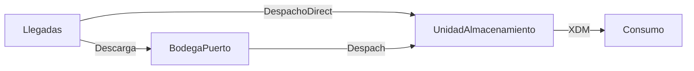
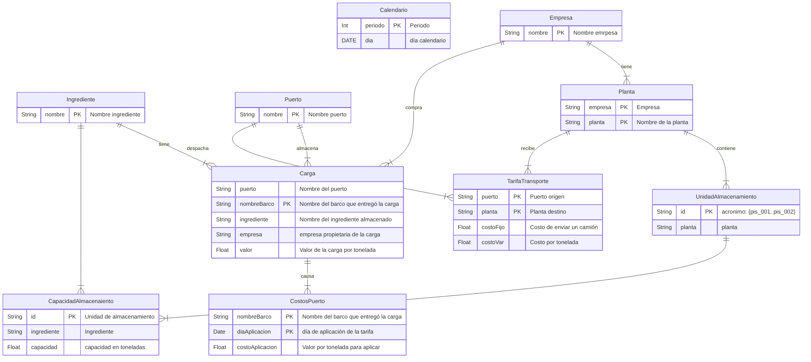

# Modelo matemático

## Abstract

El presente documento contiene el modelo matemático de programación lineal mixta que describe la situación de almacenamiento, transporte y demanda de macro ingredientes para la compañia Grupo BIOS.

## Contexto del problema

Grupo BIOS es un grupo de empresas dedicadas a la fabricación de productos agrícolas destinados a diferentes propósitos. Para efectos de dicha fabricación emplea varias materias primas que son procesadas en 13 plantas al interior de Colombia y que tienen origen en el extranjero.

Dado el origen de las materias primas, surgen una serie de operaciones logísticas para colocalas en las plantas con sus correspondientes costos y restricciones asociadas.

El modelo matemático descrito a continuación ayudará un usuario experto en la operación de Grupo BIOS a encontrar el mejor conjunto de decisiones que conduzcan a causar el menor costo logistico durante un periodo dado. Dichas decisiones estan asociadas específicamente con:

- La cantidad de materias primas a almacenar en puerto;
- la cantidad de materias primas a despachar entre el puerto y las 13 plantas y;
- la unidad de almacenamiento en donde se almacenará la materia prima que llega a las plantas y las que se usarán para cumplir con la demanda proyectada de consumo.

El criterio que el modelo matemático empleará para guiar la construcción de la decisión que se le recomendará al usuario resulta de calcular el costo logistico total derivado de los costos de almacenamiento causados en los puertos durante las fechas de corte y, los costos asociados al envio de ingredientes desde los puertos hacia las plantas bajo la tabla de fletes suministrada.

Dentro de las restricciones que el modelo matemático observará están: no exceder las capacidades de almacenamiento de las fábricas; el cumplimiento de la demanda proyectada y; mantener en la medida de lo posible los inventarios al final del día sobre los inventarios de seguridad establecidos.

Como insumo para el modelo matemático, Grupo BIOS ha suministrado información relacionada con: la llegada de carga a los puertos; los inventarios actuales en cada puerto; las cantidades en tránsito entre el puerto y las plantas; las cantidades almacenadas en las plantas de cada ingrediente y cómo están distribuídas en las unidades de almacenamiento y; los consumos proyectados de cada ingrediente. Adicionalmente, se ha suministrado la tabla de fletes con los costos del transporte por tonelada entre las ubicaciones de los puertos y las de las plantas, los costos de venta de ingredientes entre las empresas.

El modelo matemático no tendrá como objetivo responder a preguntas o cuestiones adicionales relacioandas con otras decisiones, por ejemplo:

- la cantidad de materias primas a comprar;
- la cantidad de materias primas a consumir para fabricar el producto terminado;
- la forma como se mezclarán las materias primas en las plantas;
- los esquemas de negociación de tarifas de almacenamiento, transporte;
- ni ningún otro aspecto del negocio que no haya sido explícitamente discutido, aprobado y costeado por parte de WA Solutions, Esteban Restrepo y Luis Fernando Pinilla.

## Conceptualización de la solución

Esquemáticamente, el flujo de material sin tener en cuenta el tiempo, puede representarse de la siguiente manera:

## Modelos entidad relación

# Modelo matemático
## Variables, parámetros y conjuntos
### Sets:

$T$ : día $i = 1,2,...,30$

$E$ : Empresas $e = Contegral, Finca$

$I$ : Ingredientes $i = Maiz, Harina, ...$

$J$ : Puertos $j = Buenaventura, Santamarta, Cartagena, ...$

$K$ : Plantas $k = Medellín, Bogotá, ... \in E$ 

$L$ : Cargas en Puerto $l=1,2,3,.. \in J \in I \in E$

$M$ : Unidades de Almacenamiento $m = 1,2,3... \in K$

### Parameters

#### Parámetros asociados a almacenamiento en puerto

$AR_{l}^{t}$ : Cantidad de material que va a llegar a la carga $l$ durante el día $t$, sabiendo que: $material \in I$ y $carga \in J$.

$CC_{l}^{t}$ : Costo de almacenamiento de la carga $l$ por tonelada a cobrar al final del día $t$ en el puerto $$.

#### Parámetros asociados al transporte entre puertos y plantas

$CF_{lm}$ : Costo fijo de transporte por camión despachado llevando la carga $l$ hasta la unidad de almacenamiento $m$.

$CT_{lm}$ : Costo de transporte por tonelada despachada de la carga $l$ hasta la unidad de almacenamiento $m$.

$CW_{lm}$ : Costo de vender una carga perteneciente a una empresa a otra.

$TT_{jk}$ : tiempo en días para transportar la carga desde el puerto $j$ hacia la planta $k$.

#### Parámetros asociados a la operación en planta

$CA_{m}^{i}$ : Capacidad de almacenamiento de la unidad $m$ en toneladas del ingrediente $i$, tenendo en cuenta que $m \in K$.

$DM_{ki}^{t}$: Demanda del ingrediente $i$ en la planta $k$ durante el día $t$.

$CD_{ik}^{t}$ : Costo de no satisfacer la demanda del ingrediente $i$  en la planta $k$ durante el día $t$.

$SS_{ik}^{t}$ : Inventario de seguridad a tener del ingrediente $i$ en la planta $k$ al final del día $t$.

$CS_{ik}^{t}$ : Costo de no satisfacer el inventario de seguridad para el ingrediente $i$ en la planta $k$ durante el día $t$.

### Variables

#### Variables asociadas al almacenamiento en puerto

$XIP_{j}^{t}$ : Cantidad de la carga $l$ en puerto al final del periodo $t$

#### Variables asociadas al transporte entre puertos y plantas

$XTR_{lm}^{t}$ : Cantidad de carga $l$ en puerto a transportar hacia la unidad $m$ durante el día $t$

$XTD_{lm}^{t}$ : Cantidad de carga $l$ en barco a transportar bajo despacho directo hacia la unidad $m$ durante el día $t$

$XTI_{lm}^{t}$ : Cantidad de camiones con carga $l$ a despachar hacia la unidad $m$ durante el día $t$

$ITR_{lm}^{t}$ : Cantidad de camiones con carga $l$ almacenada en puerto a transportar hacia la unidad $m$ durante el día $t$

#### Variables asociadas a la operación en planta

$XIU_{m}^{t}$ : Cantidad de ingrediente almacenado en la unidad de almacenameinto $m$ al final del periodo $t$

$XDM_{im}^{t}$: Cantidad de producto $i$ a sacar de la unidad de almacenamiento $m$ para satisfacer la demanda e el día $t$.

$BSS_{ik}^{t}$ : sí se cumple que el inventario del ingrediente $i$ en la planta $k$ al final del día $t$ esté sobre el nivel de seguridad $SS_{ik}^{t}$

$BCD_{ik}^{t}$ : sí estará permitido que la demanda de un ingrediente $i$ no se satisfaga en la planta $k$ al final del día $t$

## Función Objetivo:

### Costos por almacenamiento
#### Almacenamiento en puerto por corte de Facturación:

Dado que las cargas almacenadas en el puerto causan un costo de almacenamiento que suma al costo total, la suma de los productos escalares entre el costo de almacenamiento colocado a cada carga $l$ en el tiempo y la cantidad almacenada al final del día $t$, nos dará el componente del costo del almacenamiento en el puerto. Así:

$$\sum_{l \in j}{\sum_{t \in T}{CC_{l}^{t} \cdot XIP_{l}^{t}}}$$

#### Costo de mantener una unidad de almacenamiento activa con algun ingrediente

Pendiente por modelar

### Costos por transporte
#### Costo variable de transportar cargas desde puertos hacia plantas

Existe una tabla de fletes que muestra el costo por tonelada a enviar desde plantas hacia los puertos. dado que no esta definido el costo desde una carga en particular en un puerto hacia una unidad de almacenamiento, asumiremos que el costo de despacho de carga entre puertos y fábricas se puede aplicar de esta manera. Así las cosas usaremos los diccionarios para saber qué cargas están en qué puerto y cuáles unidades de almacenamiento están en qué fábrica.

$$ \sum_{l \in j}{\sum_{m \in k}{\sum_{t}{(XTR_{lm}^{t} + XTD_{lm}^{t})} \cdot CT_{lm}}}$$

#### Costo fijo de transportar un camion desde puerto hacia plantas

Aunque las negociaciones están dadas por toneada, existe la posibilidad que se decida en el modelo despachar una cantidad muy baja en un camión, lo que se verá como un error del modelo. La forma de evitar este comportamiento es asignar un valor fijo por camión, de esta manera el modelo intentará despachar cantidades razonables en cada camión. Esta expresión en la función objetivo debe estar atada a una restricción sobre la cantidad de camiones y toneladas a despachar

$$ \sum_{l \in j}{\sum_{l \in E }\sum_{t}{{XTI_{lm}^{t}}} \cdot CF_{lm}}$$

### Costos por Penalización
#### Costo de no respetar un inventario de seguridad de un ingrediente en una planta

$$ \sum_{i}{\sum_{k}{\sum_{t}{CS_{ik}^{t} \cdot BSS_{ik}^{t}}}} $$

#### Costo de no satisfacer una demanda en una planta

$$ \sum_{i}{\sum_{k}{\sum_{t}{CD_{ik}^{t} \cdot BCD_{ik}^{t}}}} $$

## Restricciones

### Restricciones por manejo del material
### Satisfaccion de la demanda en las plantas

Dado que el modelo debe decidir la cantidad de producto $i$ que debe extraerse de cada almacenamiento $m$, la suma de todas las cantidades a extraer deberá ser igual a la demanda del ingrediente $i$ en la planta $k$.

$$ \sum_{m \in i}^{t}{XDM_{m}^{t}} = DM_{ki}^{t} \cdot BCD_{ik}^{t} $$

### Mantenimiento del nivel de seguridad de igredientes en plantas

$$ \sum_{m \in i}^{t}{XDM_{m}^{t}} \geq SS_{ki}^{t} \cdot (1-BSS_{ik}^{t}) $$

### Capacidad de carga de los camiones

Asumiremos que los camiones no pueden transportar más de 34 toneladas en cada viaje.

$$ XTR_{lm}^{t} + XTD_{lm}^{t} \leq 34 \cdot XTI_{lm}^{t} $$

### Capacidad de almacenamiento en unidades de almacenamiento

$$ XIU_{m}^{t} \leq CA_{mi} $$

### Balances de masa de inventarios
#### Balance de masa en cargas en puerto

La cantidad de inventario para la carga $l$ al final del periodo $t$ será el inventario del periodo anterior, más las llegadas en el periodo actual menos todos los envios hacia las unidades de almacenamiento:

$$ XIP_{l}^{t} = XIP_{l}^{t-1} + AR_{l}^{t} - \sum_{m}{XTR_{lm}^{t}} -\sum_{m}{XTD_{lm}^{t}}: \forall{ \mathbb{t \in T}}$$

#### Balance de masa en unidades de almacenamiento por producto en planta

El inventario en las unidades de almacenamiento $m$ al final de un día $t$ es igual al inventario al final del día anterior más las llegadas desde cualquier carga $l$ teniendo en cuenta el tiempo de despacho entre puertos y plantas, menos la cantidad de producto a sacar desde la unidad $m$.

$$ XIU_{m}^{t} = XIU_{m}^{t-1} + \sum_{l}{XTR_{lm}^{t-TT}} - XDM_{km}^{t-TT}: \forall{\mathbb{t \in T}}$$

### Asignación de unidades de almacenamiento a ingredientes en el tiempo

Pendiente por formular

