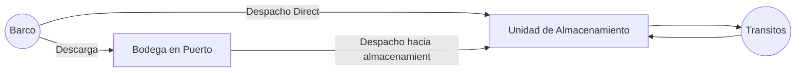
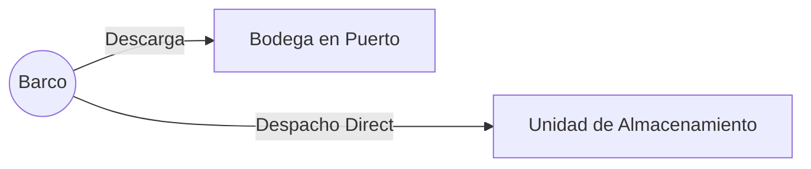

# Documento de conceptualización

## Resumen

El presente documento contiene las premisas sobre las cuales se construirá el modelo matemático de programación lineal mixta en el que se modelará la situación de almacenamiento, transporte y demanda de macro ingredientes para la compañía Grupo BIOS.

## Contexto del problema

Grupo BIOS es un grupo de empresas dedicadas a la fabricación de productos agrícolas destinados a diferentes propósitos. Para efectos de dicha fabricación emplea varias materias primas que son procesadas en 13 plantas al interior de Colombia y que tienen origen en el extranjero.

Dado el origen de las materias primas, surgen una serie de operaciones logísticas para colocarlas en las plantas con sus correspondientes costos y restricciones asociadas.

Las premisas que se describen a continuación dictarán la manera como la herramienta de trabajo del usuario experto en la operación de Grupo BIOS configurará la mejor decisión logística partiendo de la información disponible y suministrada, y que de acuerdo con los entendimientos durante las reuniones del equipo de trabajo, conducirá hacia obtener el menor costo logístico durante un periodo dado. Dicha decisión está asociada específicamente con determinar:

- La cantidad de materias primas a almacenar en puerto de acuerdo con la información de barcos pendientes por llegar y las cargas actualmente almacenadas a los puertos;
- la cantidad de materias primas a despachar y el momento para hacerlo entre los puertos y las 13 plantas y la unidad de despacho a donde llegarán estas cargas;
- Las unidades de almacenamiento desde donde deberán consumirse las materias primas de acuerdo con la demanda proyectada de consumo que el usuario experto suministre.

El modelo matemático a construir no tendrá como objetivo responder a preguntas o cuestiones adicionales relacionadas con otras decisiones o aspectos, por ejemplo:

- la cantidad de materias primas a comprar;
- la cantidad de materias primas a consumir para fabricar el producto terminado;
- la forma como se mezclarán las materias primas en las plantas;
- los esquemas de negociación de tarifas de almacenamiento, transporte;
- ni ningún otro aspecto del negocio que no haya sido explícitamente discutido, aprobado y costeado por parte de WA Solutions, Esteban Restrepo y Luis Fernando Pinilla.

## Conceptualización de la solución

El modelo matemático que se ha identificado como el más adecuado para aproximar una solución que ayuda al usuario a configurar la solución descrita, corresponde a un modelo de optimización para flujo en redes con nodos y arcos, que incluye el tiempo como parámetro enriquecido y restricciones conmutables usando variables binarias. 

En general, cada nodo abstrae la cantidad de inventario de un ingrediente particular en un periodo y lugar específico de la cadena de suministro que se ha incluido en el modelo y los arcos representan traslado de dicho inventario entre los nodos, lo anterior teniendo en cuenta en todo momento los balances de masa.

Esquemáticamente, el flujo de material sin tener en cuenta el tiempo, puede representarse de la siguiente manera:

# Modelo matemático

Los modelos matemáticos son conjuntos de expresiones matemáticas relacionadas entre si que describen un sistema y permiten efectuar cálculos con el fin de encontrar una alternativa que optimiza la manera de alcanzar un objetivo mientras que se satisfacen una serie de restricciones que representan aspectos puntuales del sistema.

El sistema que se pretende modelar ha sido descrito por el personal de Grupo BIOS durante sesiones de trabajo con el equipo de WA Solutions, quien ha construido el modelo a partir de la interpretación resultante en cada sesión de trabajo.

Las expresiones matemáticas son construidas usando variables, conjuntos y parámetros, que serán descritos a continuación.

## Variables, parámetros y conjuntos

### Conjuntos:

El modelo tiene una granularidad diaria, los días en el horizonte de planeación definido constituye el conjunto de periodos.

Las empresas involucradas en la operación son Contegral y Finca. La importancia de este conjunto radica en hay un costo relevante de "venta" de material entre una y otra cuando sea necesario.

Los ingredientes que serán almacenados en distintos puntos de la cadena de suministro relevante al modelo componen el conjunto de ingredientes.

Los puertos a donde llega la carga y desde donde se puede despachar el producto o almacenarlo según sea conveniente, además son el punto de origen en la tabla de fletes para obtener el costo de transporte, constituyen el conjunto de puertos

Las 13 plantas distribuidas al interior del país y que consumen los macro ingredientes del conjunto ya descrito, y que son el destino para el cálculo de los costos de transporte, además de totalizar la capacidad de almacenamiento y requerir inventarios de seguridad, constituyen el conjunto de plantas.

La agrupación entre un ingrediente y el nombre del barco permiten individualizar una carga, desde donde se pueden obtener atributos como la cantidad de producto pendiente por llegar a puerto o, almacenada en bodega en el mismo, constituyen una carga que puede agruparse en un conjunto del mismo nombre.

Las unidades de almacenamiento que se encuentran en las plantas y que tienen una capacidad en toneladas por cada ingrediente conforman el conjunto de unidades de almacenamiento. Desde estas unidades se descontará el inventario con base en la demanda diaria entregada por Grupo BIOS. Adicionalmente estas pueden contener diferentes tipos de producto según se ha descrito y la suma de sus contenidos conforman el inventario del ingrediente en la planta y, que deberá interactuar con las capacidades máximas de almacenamiento e inventarios de seguridad.

### Parámetros

Los parámetros son valores encontrados dentro de la información suministrada por el usuario cada vez que requiere evaluar una alternativa de despacho. Estos se asocian a diferentes aspectos del negocio según se explica a continuación

#### Parámetros asociados a almacenamiento en puerto

Cantidad de material que viene en barco y que va a llegar al puerto durante una fecha estimada (ver el siguiente diagrama). 

Costo de almacenamiento de la carga por tonelada a cobrar al final del día en el puerto.

#### Parámetros asociados al transporte entre puertos y plantas

Costo fijo de transporte por camión despachado llevando la carga hasta la unidad de almacenamiento.

Costo de transporte por tonelada despachada de la carga hasta la unidad de almacenamiento.

Costo de vender una carga perteneciente a una empresa a otra.

tiempo en días para transportar la carga desde el puerto hacia la planta.

#### Parámetros asociados a la operación en planta

Capacidad de almacenamiento de la unidad en toneladas del ingrediente, teniendo en cuenta que cada unidad pertenece a una planta.

Demanda del ingrediente en la planta durante cada día en el horizonte de planeación.

Inventario de seguridad a tener del ingrediente en la planta al final del día.

### Variables

Las variables son los elementos matemáticos que se asocian con la decisión a tomar y tienen relación directa con los parámetros y los conjuntos descritos anteriormente. A continuación se describe la lista de variables:

#### Variables asociadas al almacenamiento en puerto

Cantidad de la carga en puerto al final de cada día durante el horizonte de planeación.

#### Variables asociadas al transporte entre puertos y plantas

Cantidad de carga en puerto a despachar hacia la unidad de almacenamiento durante el día.

Cantidad de camiones con carga en puerto a despachar hacia la unidad de almacenamiento durante el día.

Cantidad de carga en barco a transportar bajo despacho directo hacia la unidad de almacenamiento durante un día particular dentro del horizonte de planeación.

Cantidad de camiones con carga a despachar directamente hacia la unidad de almacenamiento durante un día particular dentro del horizonte de planeación.

#### Variables asociadas a la operación en planta

Cantidad de ingrediente almacenado en la unidad de almacenamiento al final de cada día.

Cantidad de producto a sacar de la unidad de almacenamiento para satisfacer la demanda del día.

Variable para determinar cuándo se permite que el inventario del ingrediente en la planta al final del día esté por debajo del nivel de seguridad definido

Variable para determinar cuándo estará permitido que la demanda de un ingrediente no se satisfaga en la planta al final del día.

## Función Objetivo:

La función objetivo es el criterio general que toma el solucionador del modelo para seleccionar la mejor decisión que cumple con todas las restricciones. 

Para efectos del problema, se ha definido que esta función está relacionada con los costos totales causados al final del horizonte de planeación. Estos costos son el resultado del cobro por almacenamiento en puerto durante los cortes de facturación para cada carga y, los costos de transporte causados para despachar la carga desde el puerto a la planta según la tabla de fletes suministrada.

### Costos por almacenamiento

#### Almacenamiento en puerto por corte de Facturación:

Dado que las cargas almacenadas en el puerto causan un costo de almacenamiento que suma al costo total, la suma de las multiplicaciones entre el costo de almacenamiento y la cantidad almacenada con cada carga en el tiempo.

### Costos por transporte

#### Costo variable de transportar cargas desde puertos hacia plantas

Existe una tabla de fletes que muestra el costo por tonelada a enviar desde plantas hacia los puertos. dado que no está definido el costo desde una carga en particular en un puerto hacia una unidad de almacenamiento, asumiremos que el costo de despacho de carga entre puertos y fábricas se puede aplicar de esta manera.

#### Costo fijo de transportar un camión desde puerto hacia plantas

Aunque las negociaciones están dadas por tonelada transportada de manera terrestre entre el origen y destino, existe la posibilidad que en el futuro se decida agregar algún costo fijo asociado al despacho por camión. Mientras tanto, este costo se asumirá como cero.

### Costos por Penalización

Los costos por penalización son elementos matemáticos empleados para tratar con restricciones blandas, de modo que es posible para el solucionador permitir que ciertas restricciones no se cumplan y se garantice la factibilidad de la solución. 

a continuación, se describen las restricciones que por la naturaleza del negocio podrán no cumplirse: 

#### Costo de no respetar un inventario de seguridad de un ingrediente en una planta

El solucionador del modelo intentará en todo momento garantizar que todas las plantas mantengan el nivel de inventario sobre el nivel de seguridad. Sin embargo, cuando un ingrediente esta escaso, como primera contingencia se permitirá que el nivel de ingredientes baje por debajo de dicho nivel. El usuario será alertado de esta situación para el momento cuando se estima que ocurrirá

#### Costo de no satisfacer una demanda en una planta

Del mismo modo, si el nivel de escasez de un ingrediente es tal, el solucionador permitirá que la demanda de la planta no sea satisfecha y se alertará al usuario de esta situación.

## Restricciones

### Satisfacción de la demanda en las plantas

Dado que el modelo debe decidir la cantidad de producto que debe extraerse de cada almacenamiento, la suma de todas las cantidades a extraer deberá ser igual a la demanda del ingrediente en la planta.

#### Mantenimiento del nivel de seguridad de ingredientes en plantas

Los inventarios finales de ingredientes deberán ser mayores o iguales al nivel de seguridad definido por el usuario. En caso que exista escasez, se permitirá ignorar esta condición y se alertará al usuario.

#### Capacidad de carga de los camiones

Asumiremos que los camiones no pueden transportar más de 34 toneladas en cada viaje.

#### Capacidad de almacenamiento en unidades de almacenamiento

La cantidad de ingredientes almacenados en cada unidad de almacenamiento no debe superar el máximo especificado.

### Balances de masa de inventarios

Los inventarios deben respetar el balance de masas, esto implica que las cantidades de inventario al final de cualquier día deben ser iguales a las cantidades iniciales de ese día, más las cantidades que llegan, menos las que se consumen o despachan. Lo anterior aplica para todo nodo que implica material almacenado.
